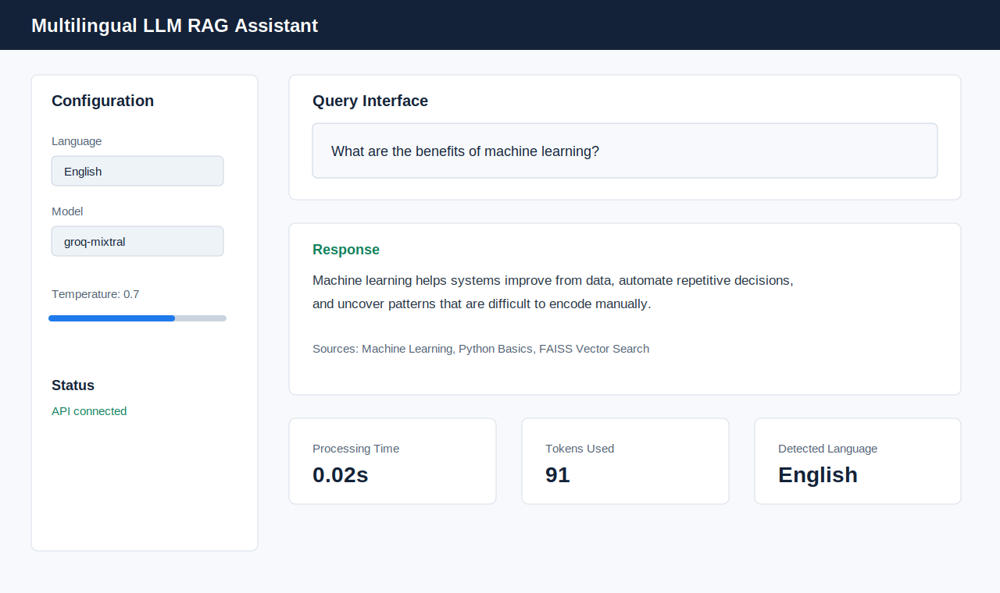
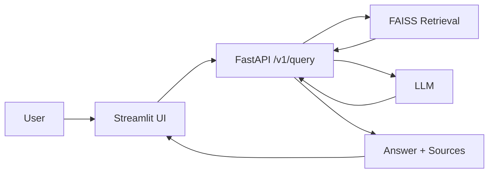

# Multilingual LLM RAG Assistant

[](https://huggingface.co/spaces/1Abhi1221/multilingual-llm-rag-assistant)
[](https://github.com/Abhi123aan/multilingual-llm-rag-assistant/actions/workflows/tests.yml)


A bilingual retrieval-augmented generation assistant with a Streamlit chat UI, FastAPI backend, FAISS-style retrieval layer, and API tests.

## Live Demo

Try the deployed app on Hugging Face Spaces:

https://huggingface.co/spaces/1Abhi1221/multilingual-llm-rag-assistant

## Demo



## Why This Project

LLMs often answer confidently even when they do not have the right context. This project shows the practical RAG pattern: retrieve relevant source snippets first, pass that context to the generation layer, and return both an answer and citations. The engineering challenge is wiring a usable frontend, API validation, retrieval, observability, and deployment into one reproducible app.

## Architecture



## RAG vs Naive LLM

| Capability | Naive LLM | RAG-augmented assistant |
| --- | --- | --- |
| Uses project knowledge base | No | Yes |
| Returns source snippets | No | Yes |
| Easier to audit | Limited | Better, because retrieved context is returned |
| Can be updated without retraining | No | Yes, update indexed documents |

## Features

- English and Hindi query handling
- FastAPI backend with validated request and response models
- Versioned `/v1/query` endpoint plus legacy `/query` support
- Streamlit frontend for interactive queries
- Source snippets and basic response metadata
- Basic Prometheus-format `/metrics` endpoint
- Docker Compose setup for local backend and frontend
- Pytest suite and GitHub Actions CI

## Supported Languages

This repository currently supports:

| Code | Language |
| --- | --- |
| `en` | English |
| `hi` | Hindi |

The app is intentionally described as bilingual until more languages are implemented and tested.

## Quick Start

### Run with Docker

```bash
cp .env.example .env
# Add GROQ_API_KEY if you connect a real hosted LLM.
docker-compose up --build
```

Open:

- Streamlit UI: http://localhost:7860
- FastAPI docs: http://localhost:8000/docs

### Run with Python

```bash
python -m pip install -r requirements.txt
python main.py
```

In another terminal:

```bash
streamlit run app.py --server.port=7860
```

## API

### Health

```bash
curl http://localhost:8000/health
```

### Query

```bash
curl -X POST http://localhost:8000/v1/query \
  -H "Content-Type: application/json" \
  -d '{
    "query": "What is machine learning?",
    "language": "english",
    "model": "groq-mixtral",
    "temperature": 0.7,
    "max_tokens": 1000
  }'
```

### Metrics

```bash
curl http://localhost:8000/metrics
```

## Project Structure

```text
.
├── src/
│   ├── api/                # FastAPI application
│   ├── rag/                # Retrieval and generation helpers
│   └── utils/              # Shared utility namespace
├── docs/                   # Demo assets and benchmark notes
├── scripts/                # Ingestion and load-test helpers
├── tests/                  # Pytest API coverage
├── app.py                  # Streamlit UI
├── main.py                 # Compatibility launcher for src.api.main
├── docker-compose.yml
├── Dockerfile
└── requirements.txt
```

## Tests

```bash
pytest -q
```

The current tests cover health checks, `/v1/query`, legacy `/query`, validation failures, configuration endpoints, and `/metrics`.

## Performance

No verified load-test result is claimed yet. Benchmark notes live in [docs/benchmark.md](docs/benchmark.md), and a starter Locust file is available at [scripts/locustfile.py](scripts/locustfile.py).

Once a repeatable run is completed, add the environment, command, and results table here.

| Scenario | Users | p50 latency | p95 latency | Error rate |
| --- | ---: | ---: | ---: | ---: |
| Pending benchmark | TBD | TBD | TBD | TBD |

## Roadmap

- Add persistent ChromaDB or Qdrant storage instead of demo in-memory retrieval
- Add RAGAS evaluation for faithfulness, answer relevancy, and context precision
- Add LangSmith or MLflow tracing for latency, token usage, and model metadata
- Add real rate limiting with SlowAPI or an API gateway
- Expand language coverage beyond English and Hindi
